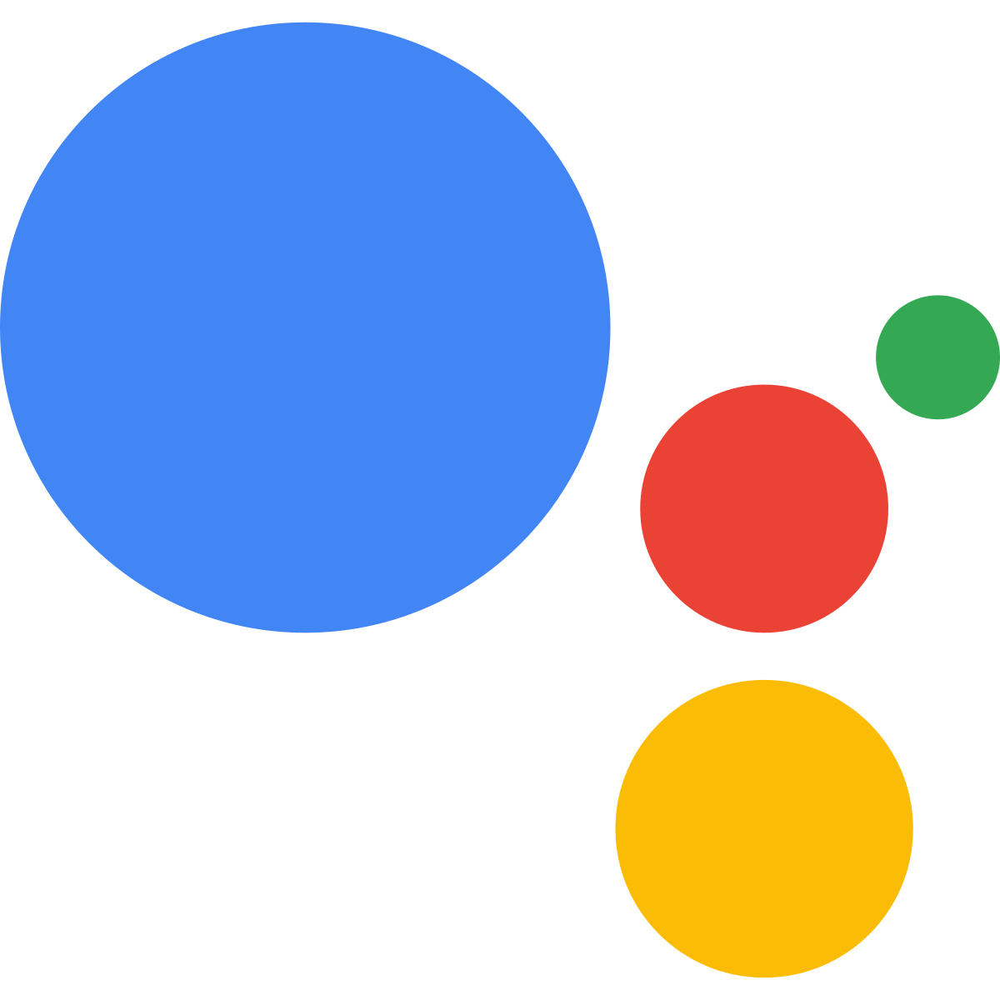

# Introduction à l'Intelligence Artificielle

L'intelligence artificielle (IA) est un domaine de l'informatique qui vise à créer des systèmes capables de simuler l'intelligence humaine. Ces systèmes sont conçus pour effectuer des tâches qui nécessitent normalement l'intervention humaine, telles que la **reconnaissance vocale**, la **vision par ordinateur**, la **prise de décision**, etc. Et pour ça, les algorithmes vont **s'entraîner** sur de larges **jeux de données** fournis à la machine.

Pensez à votre petit cousin qui apprend à faire la différence entre un 6 et un 9 : on lui montre des images de 6 et de 9 jusqu'à ce qu'il arrive à les distinguer. Bah voilà, une IA ça apprend pareil que votre petit cousin de 4 ans, et c'est fondamentalement pas bien plus intelligent que ça.

 

Vous vous en doutez, mais vous connaissez déjà pas mal de cas d'usage que vous utilisez probablement très souvent, par exemple :

| Outil d'IA | Description | Exemple de services |
| --- | --- | --- |
| Assistants vocaux | Les assistants vocaux sont des programmes informatiques qui utilisent la reconnaissance vocale, le traitement du langage naturel et l'apprentissage automatique pour comprendre et répondre aux commandes vocales des utilisateurs. |    |
| Systèmes de recommandation | Les systèmes de recommandation sont des algorithmes d'IA qui analysent les préférences et le comportement des utilisateurs pour leur suggérer des produits, des services ou des contenus susceptibles de les intéresser. |   |
| Chatbots | Les chatbots sont des programmes d'IA qui utilisent le traitement du langage naturel et l'apprentissage profond pour tenir une discussion avec un utilisateur sur un sujet défini et apprendre du contexte de la conversation. |   |
| Voitures autonomes et systèmes d'aide à la conduite | Les voitures autonomes et les systèmes d'aide à la conduite sont des applications d'IA qui utilisent la vision par ordinateur, l'apprentissage automatique et la planification de mouvement pour permettre aux véhicules de se déplacer de manière autonome ou semi-autonome et d'améliorer la sécurité routière. |   |

L'IA se démocratise de plus en plus, d'où l'importance d'avoir des fondamentaux sur ce qu'est une IA ! Et c'est ce qu'on va définir ici.

## Définition

La partie une peu barbante, mais nécessaire.
En fait, c'est très difficile de définir ce qu'est une IA et ce qui la distingue d'un simple algorithme.

Selon le **Parlement Européen** :
>  *"L’IA désigne la possibilité pour une machine de reproduire des comportements liés aux humains, tels que le raisonnement, la planification et la créativité."*

Sur **Wikipédia FR**, on retrouve :
> *"L'intelligence artificielle (IA) est un ensemble de théories et de techniques visant à réaliser des machines capables de simuler l'intelligence humaine."*

Et sur **Wikipédia EN**... :
> *"Artificial intelligence (AI), in its broadest sense, is intelligence exhibited by machines, particularly computer systems. It is a field of research in computer science that develops and studies methods and software that enable machines to perceive their environment and uses learning and intelligence to take actions that maximize their chances of achieving defined goals. Such machines **may** be called AIs."*

Les définitions divergent, mais un élément récurrent, c'est le fait de simuler des actions normalement **propres à l'humain**, et notamment **d'apprendre** au fur et à mesure. Un modèle d'IA est en constante évolution en fonction des données qu'on lui fournit.

<b> 💭 Apparté : des IAs en dégénérescence cognitive ? </b>

Et oui, une IA, ça bouge tout le temps ! Par sa faculté d'apprendre des données qu'on lui fait manger, elle évolue, se modifie, en permanence, pour tâcher de devenir de plus en plus intelligente.

Vous comprenez donc assez vite qu'une IA, même avec des performances assez médiocres à l'origine, peut devenir très bonne si on continue de l'alimenter de données **de qualté**... mais l'inverse est aussi vrai ! Si on alimente une IA de données **médiocre**, elle deviendra moins bonne. Et vous savez que c'est un phénomène que vous voyez au quotidien ?

Les IAs de génération d'images 🖼️ (**Midjourney**, **DALL-E**, **Stable Diffusion**...) sont régulièrement ré-entraînées sur de larges jeux de données d'images. Des images de personnes sur Internet, des dessins d'artistes...sauf que l'émergence de ces IAs a fait pulluler sur Internet ces images générées, vous l'avez vu. Et devinez quelles images retombent dans les jeux de données utilisés pour entraîner les IAs ? Leurs propres images générées ! C'est le serpent qui se mord la queue, et la performance de ces modèles a tendance à diminuer, puisque leur point de référence devient leurs propres productions.

### ➡️ C'est ce qu'on appelle **l'effondrement des modes** 📉 (model collapse). 

Pour remédier à cela, il faut appliquer des politiques de contrôle qualité sur les datasets fournis.

## Comment on fait une IA, très simplement ?

L'IA fonctionne généralement en utilisant des algorithmes et des modèles mathématiques pour analyser et interpréter les données. Etape par étape, pour développeur une IA, on :

1. **📊 Collecte les données** : L'IA nécessite une grande quantité de données pour apprendre et s'améliorer. Ces données peuvent être des images, des textes, des vidéos, etc. **C'est une étape cruciale !** Si les données récoltées sont mauvaises ou de moindre qualité, l'IA aura des performance médiocres.

2. **🧩 Prétraitement des données** : Avant d'être utilisées par l'IA, les données doivent être nettoyées, normalisées et préparées de manière appropriée. Des données mauvaises ou inutiles ? Poubelle. Des données avec des formats différents ? A reformater. Des données qui ne sont pas convertissables en nombre ? Débrouillez-vous, mais il faut pouvoir faire des maths dessus.

3. **⚙️ Entraînement du modèle** : L'IA utilise les données prétraitées pour entraîner un modèle, qui est essentiellement un algorithme capable de prendre des décisions ou de prédire des résultats.

4. **✅ Validation et ajustement** : Une fois le modèle entraîné, il est testé avec de nouvelles données pour évaluer sa performance. Si nécessaire, le modèle est ajusté et réentraîné pour améliorer ses résultats.

5. **💻 Utilisation en production** : Une fois que le modèle est validé, il peut être utilisé pour effectuer des tâches spécifiques dans des applications réelles.

En version très simplifié, ça donne ça. Mais il est important de savoir que l'IA est un domaine en constant mouvement et qui rassemble une collection de métiers variés. Toute la partie collecte et pré-traitement des données constitue à elle seule une foule de métiers différents. Développer une IA se fait avant tout avec une équipe d'experts de différents sujets.

## Les différents types d'IA

Il existe plusieurs types d'IA. Chaque IA répond à un beoin spécifique, et seuls certaines IA peuvent répondre à chaque besoin. C'est un jeu d'association pour arriver à trouver quelle IA utiliser pour quel problème !

Pour découvrir les différentes catégories d'IA, on se retrouve à la [partie suivante](1.1_supervised_vs_unsupervised_learning.md).

