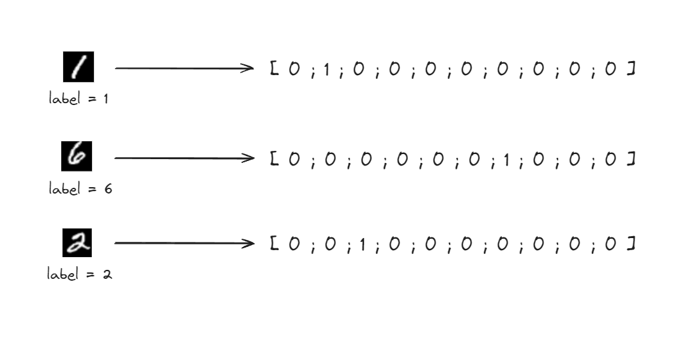

| ⚙️ / 🧠      | 🏷️ / ❌🏷️       | 🔢 / 🗳️       |
| -------------- | --------------- | --------------- |
| 🧠 Deep Learning    | 🏷️ Supervised or ❌🏷️ Unsupervised Learning     | 🔢 Régression or 🗳️ Classification     |


<br>

# Réseau de neurones
 
Bouh ça fait peur, mais vous inquiétez pas, c'est en fait assez chill (ou presque).

## 1. Fonctionnement d'un réseau neuronal

Construire un réseau de neurones, ça consiste à concaténer tout un tas de fonctions pour avoir des prédictions vraiment meilleures. Comme si on passait notre donnée dans une suite de régressions linéaires (on fait pas ça avec l'algorithme précédent de régression linéaire parce que c'est pas opti et que ça marche juste pas, mais ça vous donne une idée du principe).

Pour ça, on utilise des neurones qui sont disposés sur des couches différentes.


<br>
- Sur la **couche d'entrée** (input layer), on va donner au réseau une décomposition de notre donnée d'entrée, si nécessaire. Si on veut prédire l'objet sur une image, on lui passe une image, qui va être décomposée en niveaux de rouge, de bleu, de vert... par exemple, et chacune de ces informations sera traitée par un neurone d'entrée différent.
- Ce sont les **couches cachées** (hidden layers) qui vont faire 99,9% du travail. Ce sont ces neurones-là qui vont faire les calculs et ajouter des couches de complexité aux modèles. Il peut y avoir une, deux, dix couches de neurones cachées, en fonction des performances recherchées.
- Enfin, la **couche de sortie** (output layer) va simplement renvoyer le résultat trouvé par le réseau. Dans l'exemple ci-dessus, le réseau détecte à 62% que l'image est un chien et 38% que c'est un chat, donc le réseau de neurones dira que c'est un chien (dommage).

### Mais dis-moi Jamy, qu'est-ce qu'un neurone ?
Un neurone, c'est une fonction linéaire qui va faire un simple calcul sur nos données. On va l'accoler à une fonction d'activation, qui va casser la linéarité du réseau (sinon, il servirait pas à grand chose) et donner une sortie précise à notre neurone. Cette sortie est ensuite utilisée par d'autres neurones de la couche suivante, et ainsi de suite. C'est le "maillage" que vous voyez sur l'image : ici, tous les neurones d'une couche sont tous liés à ceux de la couche suivante.

### Mais dis-moi Jamy, qu'est-ce qu'une fonction d'activation ?
Il en existe tout un tas, mais voici quelques exemples :


Vous retrouvez entre autres, la fonction `seuil` (Perceptron), `ReLU`, qui est une sorte de seuil, la fonction `tangente hyperbolique`, `sigmoïde`...


Là tout de suite, ca fait pas mal de concepts abstraits, mais dites-vous juste qu'un réseau de neurones, ça se contente de :
-> récupérer des données d'entrée
-> traiter ces données avec une myriade de calculs simples
-> donner une sortie qui évalue le degré de confiance du réseau par rapport à sa réponse

Si on simplifie, c'est juste une très très grosse fonction mathématique avec des paramètres à trouver.
Ces paramètres justement, c'est ce qu'on appelle des **poids** et des **biais**. Sur les liens qu'il existe entre les neurones (tous les traits qui connectent les neurones entre eux sur le schéma), on peut coefficienter les valeurs, par exemple, un poids de 0.1 sur un lien va diminuer grandement l'impact du résultat du neurone précédent dans le calcul du neurone suivant.


Sur le neurone B1, on va effectuer un calcul en prenant `0.7*(A1)`, `0.4*(A2)`, `-1.3*(A3)` et `1.4*(A4)` comme entrée.
Par exemple, le neurone B1 peut sommer les entrées, et ajouter un biais, soit : `B1 = 0.7*(A1) + 0.4*(A2) + -1.3*(A3) + 1.4*(A4) + biais`. On utilise une fonction d'activation sur ce neurone, et paf, on a le résultat à envoyer aux prochains neurones.

Si vous n'avez pas tout saisi, ne vous en faites pas, voici un simple exercice pour mieux comprendre comment ça fonctionne. Calculez la sortie du neurone vert.


<details><summary>💡 Réponse :</summary>
La réponse est <strong>0</strong> !
La somme des 3 neurones bleus, avec les poids respectifs, donne -4.3. Avec le biais, on a -1.3. Avec la fonction d'activation, on a bien max(0, -1.3) = 0.
</details>

<br>

Bon tout ça c'est sympa...mais fort heureusement, vu qu'ici on parle d'intelligence artificielle, c'est la machine qui va faire tous ces calculs, décider des poids à mettre, ou de certaines fonctions à utiliser ! Dans le jargon, on appelle ce procédé de calcul de l'ordinateur de la **forward propagation** ou du **feed-forward**.

### Mais dis-moi Jamy, comment est-ce qu'on fait pour déterminer les paramètres ?
On ne va pas rentrer dans les détails mathématiques, mais globalement, le but de l'algorithme va être de minimiser la **fonction de coût** associée au réseau. La fonction de coût prend en paramètres les poids et biais, afin d'en sortir une grosse fonction dont il faut trouver le minimum. C'est comme lâcher une bille, et trouver le creux le plus bas.


Pour trouver ce minimum, on utilise un procédé mathématique un peu long et pénible qui s'appelle la **descente de gradient**. Concrètement, on calcule itérativement le gradient *(des dérivées de fonctions à plusieurs variables, si vous avez pas encore fait MT04 ou PHYS11)* en descendant la pente jusqu'à trouver le minimum. S'il est local c'est bien, global c'est mieux, mais c'est pas toujours évident (Eviden).


Beaucoup beaucoup de blabla, mais maintenant, on peut passer à la pratique !

## 2. Pratique du réseau de neurones guidée

Nous n'allons pas expliquer étape par étape l'intégration du réseau de neurones. Toutefois, on vous donne l'entièreté du code commenté, pour que vous compreniez, le fonctionnement pas-à-pas du réseau ! Après cela, vous pourrez appliquer un réseau de neurones à un autre jeu de données, sur des images... Donc restez attentifs 😉

```py
# Libraries import
import numpy as np
import pandas as pd
import matplotlib.pyplot as plt

from sklearn.preprocessing import StandardScaler
from sklearn.model_selection import train_test_split
from keras.models import Sequential
from keras.layers import Dense, LeakyReLU, ELU
from keras.optimizers import Adam

# Load the dataset
data = pd.read_csv('kc_house_data.csv')

X = data.drop(['price'], axis=1)   # We use every feature, except the price we're trying to predict
y = data['price']

# Standardize the data
scale = StandardScaler()   # Initialize the scaler
scale.fit(X)   # Fit it to the data
scaled_X = scale.transform(X)   # Transform the data according to the fitted scaler

# Separate the data as test and train data
X_train, X_test, y_train, y_test = train_test_split(scaled_X, y, test_size=0.2, random_state=42)

# Define the model
model = Sequential()   # Initialize the structure of the neural network
model.add(Dense(10, input_dim=X_train.shape[1]))   # Add a layer of 10 neurons, the input layer is implicit with X_train.shape[1] neurons
model.add(LeakyReLU(alpha=0.1))   # Tell the model that those first 10 neurons are of activation function LeakyReLU. alpha = slope for negative values (see LeakyReLU graph)
model.add(Dense(32))   # Add a layer of 32 neurons, input shape is inferred from last layer
model.add(ELU(alpha=1.0))   # Add the ELU activation function for those 32 neurons
model.add(Dense(64))   # Add a layer of 64 neurons
model.add(LeakyReLU(alpha=0.1))   # Add the LeakyReLU activation function for those 64 neurons
model.add(Dense(1, activation='linear'))   # Use a linear activation function (= no activation) for output layer. 1 neuron since we want 1 value

optimizer = Adam(learning_rate=0.003)   # Optimizer defines the process to diminish the cost function. Here, we use the Adam optimizer, an already existing algorithm

# Compile the model
model.compile(loss='mean_squared_error', optimizer=optimizer)

# Train the model
model.fit(X_train, y_train, epochs=100, batch_size=32)

# Predict house prices
y_pred = model.predict(X_test)[:, 0]

rmse = np.sqrt(np.mean((y_test - y_pred) ** 2))
print('Root Mean Squared Error:', rmse)

# Plot the predicted values against the actual values using a linear regression model
plt.scatter(y_pred, y_test)
# Plot a line x = y
plt.plot([0, max(max(y_test), max(y_pred))], [0, max(max(y_test), max(y_pred))], color='red')
plt.xlabel('Predicted Price')
plt.ylabel('Actual Price')
plt.title('Predicted Price vs Actual Price')
plt.show()
```

## 3. Pratique du réseau de neurones autonome

On va maintenant vous laisser pratiquer de vous-même les réseaux de neurones, en repartant de la base précédente, pour travailler sur le jeu de données MNIST, qui contient 70 000 images de chiffres écrits à la main sur des images de 28x28px.


Ci-dessous une liste d'indications pour vous aider sur différents points. Le but étant de pratiquer, essayez d'en utiliser le moins possible et n'hésitez pas à nous demander conseil !

Pour load le dataset, installez keras et utilisez ces lignes de code dans un fichier Python :
```
pip install tensorflow keras
```

```py
from keras.datasets import mnist

# Load the MNIST dataset
(X_train, y_train), (X_test, y_test) = mnist.load_data()
```
<br>
⚠️ Pour limiter les temps de calcul, ne sélectionnez que les 1 000 premiers éléments de <code>X_train</code> et <code>y_train</code>, comme suit :

```py
X_train = X_train[:1000]
y_train = y_train[:1000]
```

<br>
<details><summary><b>💡 Indication 1 : librairies conseillées</b></summary>
Pour commencer à doucement vous aiguiller, voici toutes les librairies utilisées :

````python
from keras.datasets import mnist   # Dataset
from keras.models import Sequential
from keras.layers import Dense, LeakyReLU, ReLU
from keras.optimizers import Adam
import numpy as np
from keras.utils import to_categorical   # To encode data in the right format
````
</details>
<br>
<details><summary><b>💡 Indication 2a : traitement des données</b></summary>
Vous pouvez afficher les images en utilisant la fonction <code>plt.imshow(X_train[i], cmap="gray")</code> suivie de <code>plt.show()</code>. Le nombre correspondant est contenu dans <code>y_train[i]</code>.

Il faut savoir que les modèles de deep learning vont, la majorité du temps, demander en entrée des vecteurs de données plutôt que des matrices. Hors, on travaille ici avec des images de 28x28px, encodées dans des matrices de 28x28 ! Vous pouvez observer le rendu via le fonction <code>print(X_train[i])</code>.
Il faut donc transformer les matrices en vecteurs...

<details><summary><b>💡 Indication 2b : transformation des matrices</b></summary>
On utilise le code suivant pour paser de matrices 28x28 à un vecteur de 284 éléments :

````python
X_train = X_train.reshape(X_train.shape[0], X_train.shape[1] * X_train.shape[2])
X_test = X_test.reshape(X_test.shape[0], X_test.shape[1] * X_test.shape[2])
````

Concrètement, on réassigne <code>X_train</code> et <code>X_test</code> (les matrices d'images) un vecteur. La fonction <code>reshape()</code> de <code>numpy</code> prend en premier argument le nombre de lignes et en second argument, le nombre de colonnes. Ici, on veut un ensemble de vecteurs de 28*28 = 784 éléments, donc c'est ce qu'on donne comme second argument. Le premier argument donne juste la taille du jeu de données. <code>X_train</code> est alors une matrice de taille 60 000x784 ! 60 000 entrées d'entraînement réparties sur 60 000 lignes.
Vous pouvez vous demander pourquoi on a transformé <code>X_train</code> en matrice alors qu'on voulait un vecteur...mais puisqu'on a tout un dataset, on a nécessairement une multitude d'entrées réparties dans une matrice. Mais on est ainsi passés d'une matrice...de matrices, à une matrice de vecteurs, et l'objectif est rempli.
</details>

<details><summary><b>💡 Indication 2c : encodage des données</b></summary>
Un réseau de neurones est un algorithme de <b>classifiction</b> ! C'est-à-dire qu'il donne en sortie une probabilité qu'un objet appartienne à une catégorie. Ici, dans <code>y_train</code> et <code>y_test</code>, on a des éléments entiers de 0 à 9 qui représentent le nombre de l'image. Mais notre réseau de neurones, lui, ne comprend pas très bien ce genre de données. Pour lui simplifier la tâche, on lui traduit ces données dans des catégories simples.



Ce procédé s'appelle du <code><i>One Hot Encoding</i></code>. Et pour ça, on utilise <code>to_categorical()</code> de <code>keras</code>.

````python
y_train = to_categorical(y_train)
y_test = to_categorical(y_test)
````
</details>
</details>

<br>

Afin d'améliorer les performances, la stabilité, et la compatibilité des données, on va toujours chercher à les translater sur une plage <code>[-1, 1]</code> ou <code>[0, 1]</code>. Par exemple, la fonction d'activation <b><i>sigmoïde</i></b> n'accepte que des entrées entre 0 et 1 (jusque-là, logique). Donc pour mieux faire converger nos modèles, pensez à mapper les données sur la plage appropriée !

<details><summary><b>💡 Indication 3 : mappage des données</b></summary>
En regardant les données contenues dans les images, vous voyez que chaque pixel est représenté par une valeur allant de 0 à 255 (les images étant en noir et blanc, on a seulement une valeur de luminance et pas de RGB).
En divisant par 255, on obtient donc immédiatement des valeurs comprises entre 0 et 1.

````python
X_train = X_train / 255.0
X_test = X_test / 255.0
````
</details>

<br>

Pour vous simplifier le travail, n'hésitez pas à reprendre le réseau neuronal précédent, en retirant éventuellement une couche cachée pour limiter le temps de calcul.
⚠️ Utilisez une fonction d'activation de la couche de sortie adaptée ! Pensez au mappage de vos données...

<br>

<details><summary><b>💡 Indication 4 : définition du modèle</b></summary>
Suivant les indications ci-dessus, on a (par exemple) :

````python
model = Sequential()
model.add(Dense(10, input_dim=X_train.shape[1]))
model.add(LeakyReLU(alpha=0.1))
model.add(Dense(32))
model.add(LeakyReLU(alpha=0.1))
model.add(Dense(10, activation='sigmoid'))

optimizer = Adam(learning_rate=0.003)

model.compile(loss='mean_squared_error', optimizer=optimizer, metrics=['accuracy'])
model.fit(X_train, y_train, epochs=50, batch_size=32)
````
</details>

<br>

On peut évaluer les performances du modèle à reconnaitre les bons nombres avec une simple métrique d'<code>accuracy</code> :

```py
test_loss, test_acc = model.evaluate(X_test, y_test)
print('Test accuracy:', test_acc)
```

<br>

En fonction de vos paramètres, on obtiendra facilement un très bon résultat au-dessus de 80% compte tenu de la simplicité du modèle et du peu de données utilisées.

<br>

## Bravo ! 🎉
Vous êtes arrivés à la fin de cet atelier et avez rédigé votre premier réseau de neurones. La maîtrise de ces algorithmes vient avec énormément de pratique, notamment pour savoir quelles fonctions d'activation utiliser quand et pourquoi.

Si le sujet vous a intéressé, n'hésitez pas à vous documenter sur Internet. Les cours de [Harvard](https://pll.harvard.edu/subject/neural-networks) sont gratuits, tout comme ceux de [Google](https://developers.google.com/machine-learning?hl=fr). Ceux-ci sont de fortes introductions qui mettront évidemment un plus large pied dans la technique que cet atelier.

Nous restons à votre disposition pour la moindre question, donc n'hésitez pas 😉